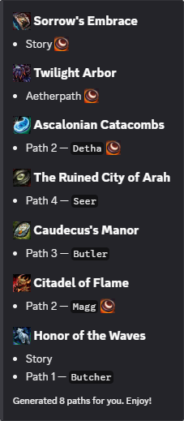

<h1 align="center">
    <sub>
      
    </sub>
    <br>
    Pathfinder
</h1>

<p align="center">
  A Guild Wars 2 Discord bot that randomizes your dungeon frequenter routes.
</p>

## Usage

Autocomplete is available for all commands. Just start typing and you'll see the options available.



### 🎲 Generate Routes

Use `/frequenter` to create a randomized dungeon route.  
Optional filters such as `no_story` and `time_of_day` let you control how paths are chosen.

Frequenter results are shown only to you unless you set the `public` parameter to `True`.

#### Aliases

- `/nightfrequenter` → only night time dungeons  
- `/dayfrequenter` → only day time dungeons  
- `/chaosfrequenter` → ignores blacklist and filters  

---

### 🚫 Manage Your Blacklist

Keep certain dungeons or paths out of your generated routes.

Blacklist commands are visible only to you.

- `/blacklist view` → shows your personal blacklist
- `/blacklist add` → exclude a dungeon or specific path
- `/blacklist remove` → re-include a dungeon or path
- `/blacklist clear` → reset your entire blacklist

> [!NOTE]
> Blacklist data is saved per user and works across servers.  
> Your blacklist only affects your own routes.

---

### 🕛 Automatic Daily Frequenter

Set up a daily automatic frequenter post for your server.

> [!IMPORTANT]
> To use this command, the `Manage Server` permission is required. Only one channel can be set up for daily posts per server.

Use `/dailyfrequenter setup` in the desired channel to enable it.  
Pathfinder will automatically post a new randomized route every day at **00:00 UTC**, matching the Guild Wars 2 server reset.

Currently, neither filters nor blacklists are considered when generating a route.

- `/dailyfrequenter view` shows the current configuration.  
- `/dailyfrequenter clear` clears the configuration.

## Dev & Hosting

> Python 3.12

### .env

>[!IMPORTANT]
> Omit `DEBUG_GUILD_ID` for production mode

Create the `.env` file in the project's root directory.

``` ini
TOKEN=1234567890.1234567890.1234567890
APP_ID=1234567890
DEBUG_GUILD_ID=1234567890
```

### Service

> [!NOTE]
> I'm using [UV](https://docs.astral.sh/uv/) to run the bot.

- `sudo nano /etc/systemd/system/pathfinder.service`
- `sudo systemctl enable pathfinder.service`
- `sudo systemctl start pathfinder.service`

``` ini
[Unit]
Description=Pathfinder Discord Bot
After=network.target

[Service]
User=root
WorkingDirectory=/root/pathfinder
ExecStart=/root/.local/bin/uv run /root/pathfinder/src/main.py
Restart=on-failure
RestartSec=5

[Install]
WantedBy=multi-user.target
```

## Data

Used to store settings and logging for debugging purposes only.

- Guild (server) IDs
- User IDs

## Credits

- Thank you Devin for the bot idea.
- Thank you Everless for the `/chaosfrequenter` concept.
- Thank you Bird for testing _("I have the urge to break things")_
